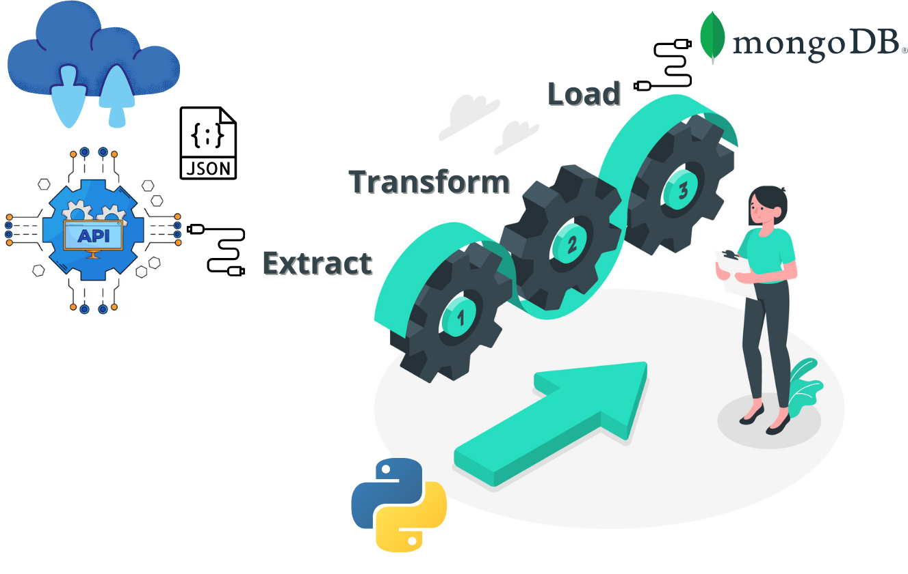
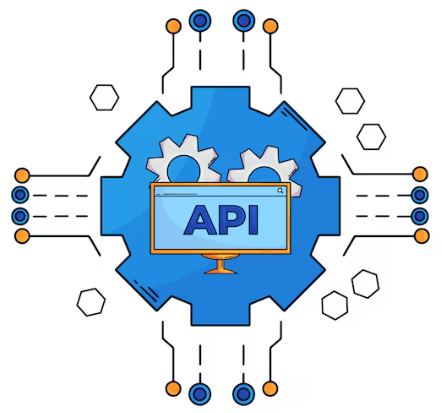
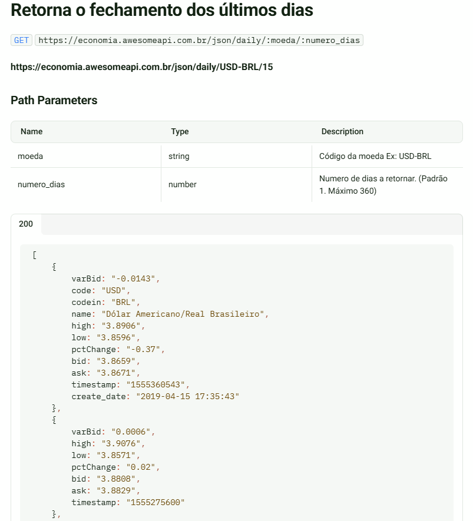
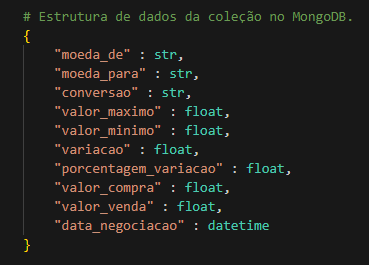

# Projeto de ETL: Python -> API -> Json -> MongoDB

## 📖Sobre:
ETL : Extract, Transform, Load, é um processo essencial no mundo da análise de dados e business intelligence. Suas etapas envolvem a extração de dados de diversas fontes, a transformação desses dados para atender às necessidades de análise e, por fim, o carregamento dos dados em um destino final, como um data warehouse.

## 📑As etapas:
* Extração (Extract): Nesta etapa, os dados são coletados de fontes variadas, como bancos de dados, arquivos, APIs, entre outros.
* Transformação (Transform): Aqui, os dados extraídos são limpos, filtrados, agregados, combinados, formatados, enriquecidos e integrados para garantir consistência e qualidade de acordo com os requisitos do sistema de destino. Transformações podem incluir a remoção de duplicatas, a conversão de formatos de dados, a padronização de valores e a criação de novas variáveis derivadas.
* Carregamento (Load): Os dados transformados são carregados em um repositório de dados, como um data warehouse, data mart ou banco de dados relacional, para análise e consulta. A carga pode ser incremental (apenas dados novos ou alterados) ou completa (todos os dados são recarregados).

## ⚙Como será nosso processo?

Para todas as etapas, **Extração**, **Transformação** e **Carregamento**, utilizaremos a linguagem de programação **Python**.

Para a Extração, nossa origem dos dados será um arquivo Json, provido pela [**API**](https://economia.awesomeapi.com.br), retornando as cotações entre moedas em tempo real de um período específico.

> **API** Application Programming Interface (Interface de Programação de Aplicação), é um conjunto de padrões, ferramentas e protocolos que permite que diferentes aplicativos interajam e compartilhem dados de forma segura e eficiente. A interface pode ser pensada como um contrato de serviço entre duas aplicações.

Para a etapa de Transformação, realizaremos todas as verificações, adequações, tratamentos e ajustes necessários para que no final, os dados estejam adequados para o processo de carregamento.

A etapa final Carregamento, realizaremos as inserções dos dados em um banco de dados **NoSQL**, em nosso caso o **MongoDB**, com o auxílio da biblioteca [**PyMongo**](https://pymongo.readthedocs.io/en/stable/installation.html) para **Python**.

>**NoSQL** (originalmente se referindo a *"no SQL"* : *"não SQL"* ou *"não relacional"*, posteriormente estendido para *Not Only SQL - Não Somente SQL*) é um termo genérico que representa os bancos de dados não relacionais.
>Uma classe definida de banco de dados que fornecem um mecanismo para armazenamento e recuperação de dados que são modelados de formas diferentes das relações tabulares usadas nos bancos de dados relacionais.

>**MongoDB** é um software de banco de dados orientado a documentos livre, de código aberto e multiplataforma, escrito na linguagem C++.
>Classificado como um programa de banco de dados NoSQL, o MongoDB usa documentos semelhantes a JSON com esquemas.
>Suas características permitem com que as aplicações modelem informações de modo muito mais natural, pois os dados podem ser aninhados em hierarquias complexas e continuar a ser indexáveis e fáceis de buscar.

## 💾Estrutura dos dados (coleção) - API

### 💬 Legendas
* bid : Compra
* ask : Venda
* varBid : Variação
* pctChange : Porcentagem de Variação
* high : Máximo
* low : Mínimo
* timestamp : Hora da negociação (UTC)
* create_date : Hora da negociação (UTC-3)

## 💾Estrutura dos dados (coleção) - MongoDB

  

### 🥚➡🐥 De : Para - Dicionário de Dados
* moeda_de : code
* moeda_para : codein
* conversao : name
* valor_maximo : high
* valor_minimo : low
* variacao : varBid
* porcentagem_variacao : pctChange
* valor_compra : bid
* valor_venda : ask
* data_negociacao : timestamp

### 💡 Projetos
* [ETL](src/etl_mongodb.py)
* [Análise Exploratória](src/eda_mongodb.ipynb)

